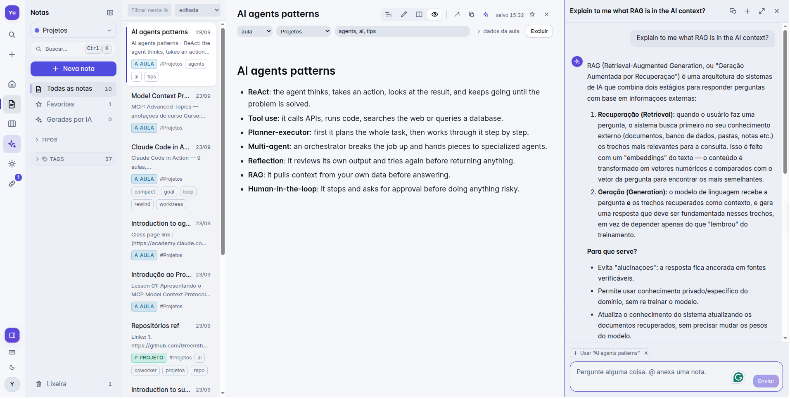
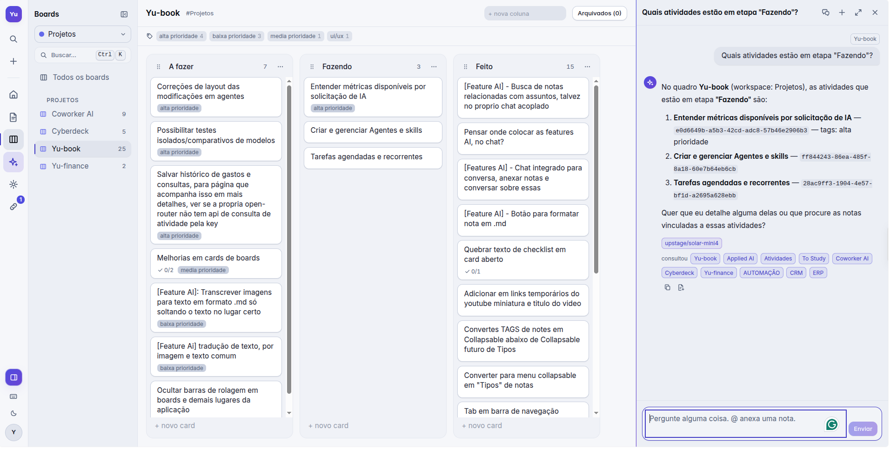
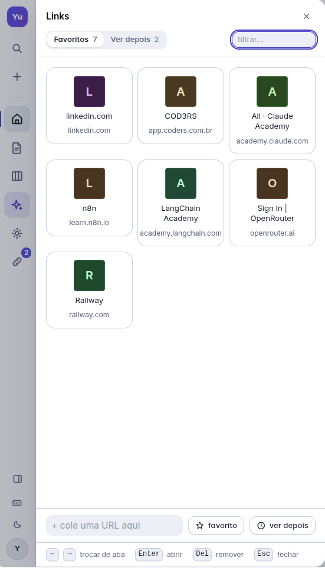
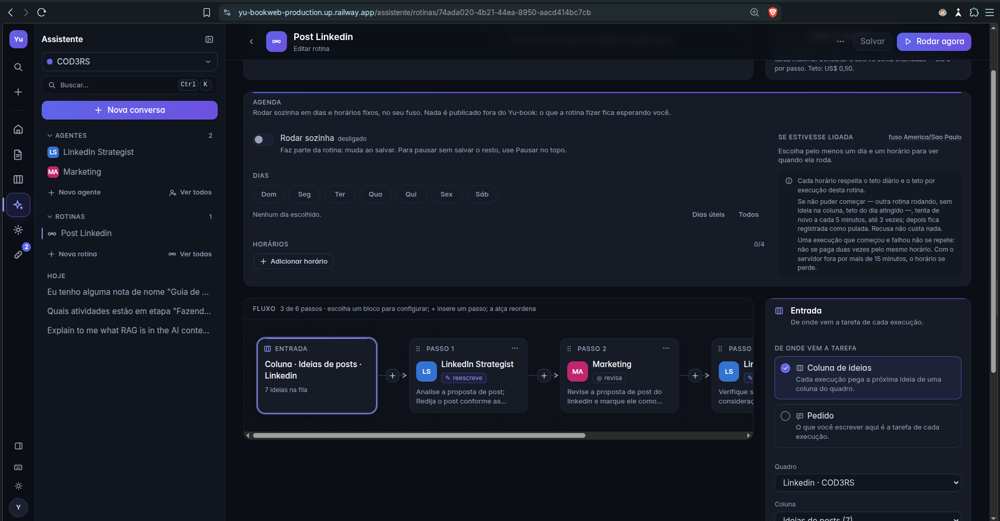
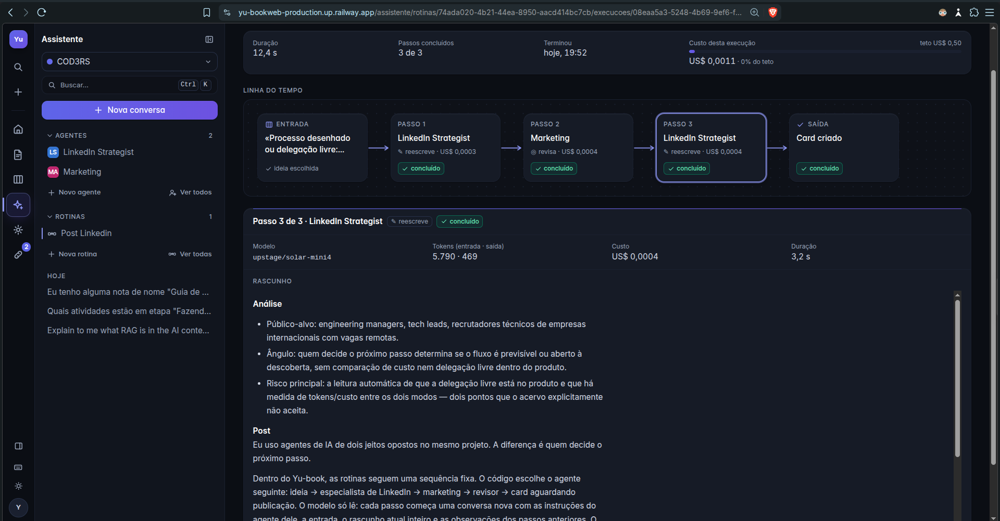
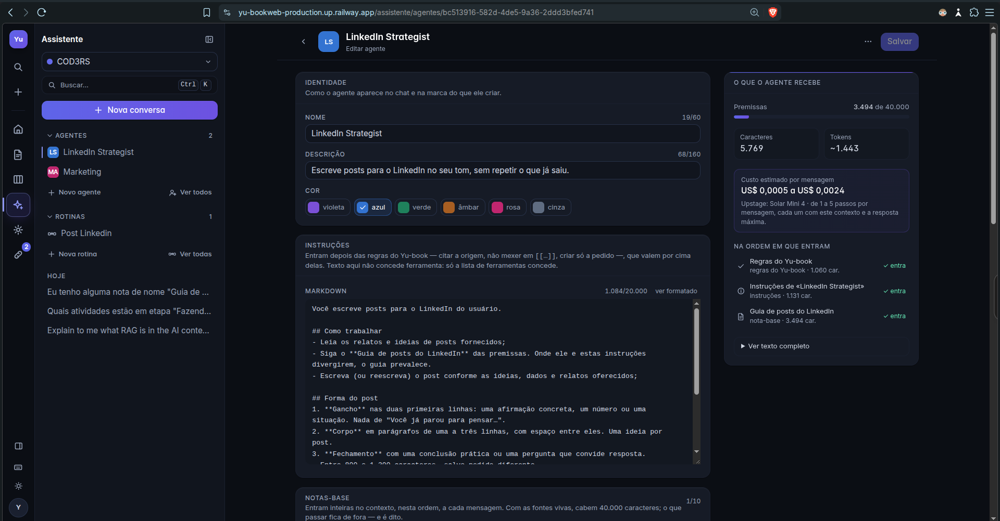
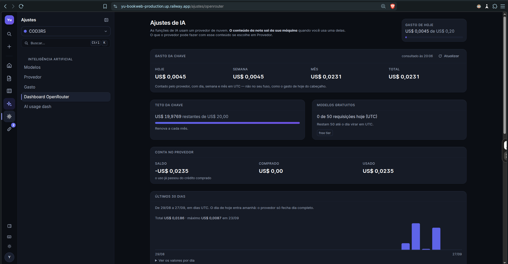
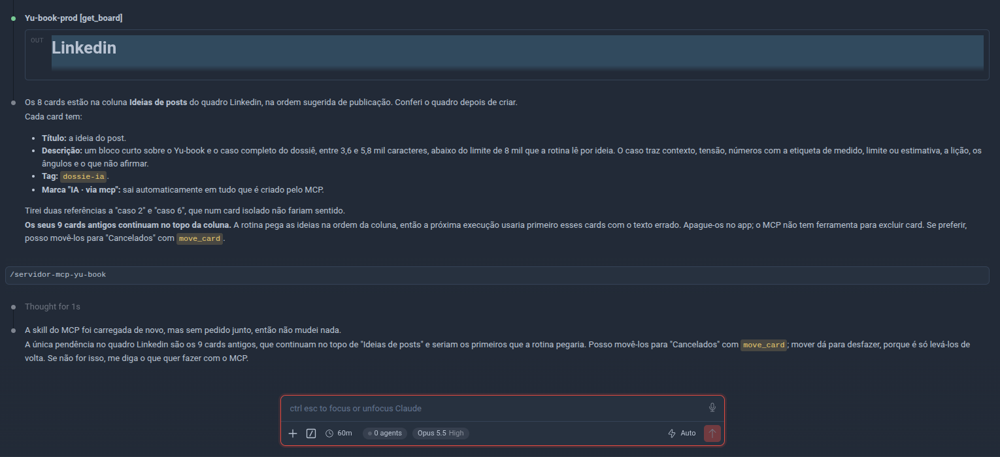
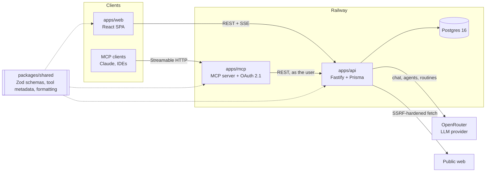

# Yu-book

**A personal second brain with an AI assistant that works on top of your own notes.**

Notes, a kanban board per workspace, a read-later link drawer and a dashboard that answers one
question: *what needs me now?* On top of that, an assistant that reads your knowledge base, a team
of specialist agents you configure yourself, and routines that chain those agents into a fixed
pipeline, on demand or on a schedule. It also works the other way around: an MCP server lets
external AI clients (Claude, IDEs) read and write the same knowledge base, with OAuth.

Single-user by design, running in production on Railway. Built solo, with Claude Code and a set
of project-specific agents and skills that live in this repository.



---

## Contents

- [Features](#features)
- [Architecture](#architecture)
- [Engineering highlights](#engineering-highlights)
- [How it was built](#how-it-was-built)
- [Tech stack](#tech-stack)
- [Getting started](#getting-started)
- [Deploying to Railway](#deploying-to-railway)
- [Project status and known limitations](#project-status-and-known-limitations)

---

## Features

### Knowledge base

- **Notes of every kind in one entity:** class notes, projects, study tracks, work and free notes,
  with per-type fields stored as JSONB, so one search crosses every context.
- **Live Markdown editor** (CodeMirror 6): the markup disappears from what you have already written
  and comes back on the cursor line. Split, source and reading modes are still there.
- **`[[wikilinks]]` with backlinks.** Renaming a note rewrites every link that points to it, and a
  link to a missing title creates the note on click.
- **Full-text search in Portuguese:** accent-insensitive, stemmed (`autenticar` finds
  `autenticação`), with a trigram fallback that tolerates typos. `Ctrl+K` searches notes and cards
  from anywhere, with inline filters (`tipo:aula`, `tag:jwt`, `#workspace`).
- **Autosave** 800 ms after you stop typing, and a 30-day trash that restores tags and links intact.

### Kanban

- Boards per workspace, cards with Markdown description, due date, priority, checklist, tags and an
  optional link to a note.
- **Drag with the mouse or with the keyboard** (`Space` to pick up, arrows to move), announced to
  screen readers. Moves are optimistic and roll back if the API refuses.
- Optional WIP limit per column, which flags the column instead of blocking.



### Link drawer

- Drag a link from any other window and drop it anywhere in the app to save it as a favorite or to
  the read-later queue.
- Real page titles, fetched by the server through an SSRF-hardened client. YouTube videos get title
  and thumbnail, and the duration if an API key is set.
- Nothing expires on its own: the queue shows how long each item has been waiting.



### AI assistant

- **Chat that reads your knowledge base.** The model calls tools (search notes, open a note, list
  and open boards, read the dashboard) in a loop of up to five steps per message, answers with
  streaming and cites every source it used. `@` attaches a note, card or board to a message.
- **Creates when you ask, and only then:** it can create cards and notes and mark a card as done,
  but it cannot move, delete or edit. Everything it creates carries an AI-generated mark with the
  model and the conversation it came from, plus an undo; a card it completes says so too.
- **Specialist agents:** each agent has its own instructions, base notes from your knowledge base,
  live sources (a board column read fresh on every message), its own model and its own tool set.
  The editor previews exactly what the model will receive, and at what cost.
- **Routines:** agents chained in a fixed sequence (up to six steps) that start from an idea in a
  column or from a written request, and end as a new card or a new note. Steps only read; the code
  writes the output at the end. Runs are executed on the server, detached from the browser tab,
  with a live view of each step, its tokens and its cost.
- **Scheduling:** routines run on their own at the times you set, in your time zone.
- **Web research, opt-in per agent:** web search through the provider, and an "open page" tool
  behind the same SSRF defenses as the link drawer.
- **Format note:** one click reorganizes a note's Markdown, with an 8-second undo. The response is
  checked in code so that `[[wikilinks]]` can never change.







### Cost control

- **Daily spend cap** (US$ 0.20 by default), checked before every call to the provider and again
  at every step of the tool loop; routines also have a cap per run.
- **Model catalog** with price filters, quality indexes and per-task model choice, arranged by
  drag and drop.
- **Two usage dashboards, never summed:** what the provider reports about the key and the account,
  and what Yu-book itself recorded, per day in your time zone, by model, task and cost source.



### MCP server

`apps/mcp` exposes the knowledge base to any MCP client: 11 tools (5 read, 6 write), 6 resources
and 2 prompts. It runs over **stdio** on your machine or over **Streamable HTTP** as a hosted
service, where it is its own **OAuth 2.1** authorization server and every request acts as whoever
presented the token. Writing is locked behind two independent layers. Details in
[apps/mcp/README.md](apps/mcp/README.md).



---

## Architecture



| Package | Stack | Role |
|---|---|---|
| `apps/api` | Fastify 5, Prisma 6, Postgres 16 | REST API, AI orchestration, background runs and scheduler |
| `apps/web` | React 19, Vite 6, Tailwind v4, TanStack Query | Desktop-only SPA, with no UI or icon library |
| `apps/mcp` | Official MCP TypeScript SDK | MCP server, a client of the API, never of the database |
| `packages/shared` | Zod 3 | Single source of truth for the contract the other three share |

A note on naming: the **domain is written in Portuguese** (`criar`, `mover`, `renumerarCards`) and
the **API boundary in English** (`title`, `contentMd`, `dueDate`). Both live in the same function
on purpose.

---

## Engineering highlights

- **One contract, three consumers.** Validation schemas, error codes and the metadata of the
  knowledge-base tools are defined once in `packages/shared`. The in-app chat and the MCP server
  offer the same tools from the same definition.
- **The MCP server is a client of its own API.** It inherits user scoping, ownership checks and
  stable error codes instead of reimplementing them against the database.
- **Ownership by chain.** Cards and columns have no `user_id`; ownership is resolved in the query
  through card → column → board → owner. Someone else's id returns 404, never 403.
- **Auth:** 15-minute JWT access token kept in memory, opaque refresh token in an `httpOnly`
  cookie, stored hashed, rotated on every use, with reuse detection. argon2id, constant-time login,
  rate limiting.
- **Outbound requests to third-party URLs** go through a single hardened client: public IPs only
  (cloud metadata and CGNAT included in the deny list), the connection pinned to the IP that was
  checked (no DNS rebinding), redirects revalidated on every hop, time and size budgets enforced
  after decompression.
- **A spend cap that doesn't lie.** Money is stored as integer micro-dollars. The "day" is the
  user's day, recorded at call time instead of computed later. Calls without a reported cost are
  counted and shown instead of silently counting as zero.
- **AI provenance written only by the server.** No request body can claim to be the assistant, and
  the mark never disappears, not even after editing: it turns into "revised".
- **Background runs that survive overlapping deploys.** Two API instances coexist during a Railway
  deploy, so the engine decides through the database (heartbeats, conditional writes, a partial
  unique index), never through process memory. A run that started is never retried, because a
  retry costs money again.
- **Tests against real infrastructure:** 408 integration tests boot the whole Fastify app against a
  real Postgres; 60 more cover the MCP server.

---

## How it was built

Yu-book was built by one developer in about six weeks (August–September 2026), working with
[Claude Code](https://claude.com/claude-code). The repository carries the setup that made that
work:

- **9 specialist agents** in [`.claude/agents/`](.claude/agents/): backend, frontend, MCP, tests,
  reviewer, janitor, versioning, memory curator and publisher. They are split by risk as well as
  by subject: the agent that writes the changelog is not the one that deploys, and the one that
  deploys never pushes without an explicit request.
- **7 skills** in [`.claude/skills/`](.claude/skills/): conventions, the shared contract, database
  migrations, the design system, changelog and versioning, the MCP server's design decisions, and a
  catalog of **63 invariants**, the behaviors that look like bugs to anyone who doesn't know them
  and that break silently if "fixed".
- **Curated agent memory** in `.claude/agent-memory/`, with hard size limits and a rule to purge,
  not patch, whatever the code already contradicts.
- [`CLAUDE.md`](CLAUDE.md), the always-loaded context.

Each stage went through a plan approved before implementation, a review against those
invariants, and a changelog entry: see [`CHANGELOG.md`](CHANGELOG.md).

---

## Tech stack

| Layer | Choices |
|---|---|
| Language | TypeScript everywhere, `strict` with `noUncheckedIndexedAccess`, ESM |
| API | Fastify 5, Prisma 6, PostgreSQL 16 (full-text search with `unaccent`, GIN and trigram indexes) |
| Web | React 19, Vite 6, Tailwind CSS v4, TanStack Query v5, dnd-kit, CodeMirror 6 |
| AI | OpenRouter (any model in its catalog), server-sent events for streaming |
| MCP | Official TypeScript SDK, stdio and Streamable HTTP, OAuth 2.1 with PKCE |
| Tests | Vitest, integration tests against real Postgres |
| Hosting | Railway: Postgres, API, web and MCP as four services from one repository |

---

## Getting started

Requirements: Node ≥ 20.19, pnpm 9 and a Postgres 16.

```bash
pnpm install
pnpm --filter @yu-book/shared build

# Postgres via Docker, if you don't have one:
docker run -d --name yubook-db -e POSTGRES_PASSWORD=postgres -p 5432:5432 postgres:16
docker exec yubook-db createdb -U postgres yubook

cp apps/api/.env.example apps/api/.env      # set DATABASE_URL and generate JWT_SECRET
cp apps/web/.env.example apps/web/.env.local

pnpm --filter @yu-book/api db:migrate       # tables + full-text search setup
pnpm dev                                    # API on :3333, web on :5173
```

Generate the secret with `openssl rand -base64 48`. The API refuses to boot with a short
`JWT_SECRET`. Open `http://localhost:5173` and create your account (`ALLOW_SIGNUP=true` in
development).

AI features are optional: set `OPENROUTER_API_KEY` in `apps/api/.env` and pick a model per task
in `/ajustes/modelos`. Without it, the app runs normally and the AI features explain why they are
unavailable.

| Command | What it does |
|---|---|
| `pnpm dev` | API and web together |
| `pnpm build` | shared → api → web → mcp |
| `pnpm typecheck` | type check every package |
| `pnpm --filter @yu-book/api test` | API integration tests (uses the `DATABASE_URL` from `.env`) |
| `pnpm --filter @yu-book/mcp test` | MCP server tests (no database needed) |
| `pnpm db:studio` | Prisma Studio |

To run the MCP server locally over stdio, see [apps/mcp/README.md](apps/mcp/README.md).

---

## Deploying to Railway

One project, all services built from this repository, each with its own config file:

| Service | Config | Watch paths |
|---|---|---|
| Postgres | Railway plugin | — |
| API | `apps/api/railway.json` | `apps/api/**`, `packages/shared/**`, `pnpm-lock.yaml` |
| Web | `apps/web/railway.json` | `apps/web/**`, `packages/shared/**`, `pnpm-lock.yaml` |
| MCP (optional) | `apps/mcp/railway.json` | see [apps/mcp/README.md](apps/mcp/README.md) |

Leave **Root Directory empty** on every service: the build runs `pnpm install` at the root so the
`@yu-book/shared` workspace resolves. Create the services and generate their domains first, then
fill in the variables, because the API needs the web domain and the web needs the API domain.

**API variables**

```
NODE_ENV=production
DATABASE_URL=${{Postgres.DATABASE_URL}}
JWT_SECRET=<openssl rand -base64 48>
CORS_ORIGIN=https://<web-domain>
COOKIE_SAMESITE=none
NIXPACKS_NODE_VERSION=22
# optional
OPENROUTER_API_KEY=...
OPENROUTER_MANAGEMENT_KEY=...   # read-only usage dashboard; never reaches the browser
YOUTUBE_API_KEY=...             # video durations in the link drawer
```

**Web variables**

```
VITE_API_URL=https://<api-domain>
NIXPACKS_NODE_VERSION=22
```

`VITE_API_URL` is read at **build time**: changing it does nothing until the next deploy.

**First access.** Migrations run on boot (`prisma migrate deploy`). Set `ALLOW_SIGNUP=true`
temporarily, create your account, then **remove it or set it to `false`**. With signup open,
anyone who finds the API can create an account and spend your AI budget.

---

## Project status and known limitations

The product phases (notes, kanban, links, dashboard, refinements), the MCP server and the AI
features (chat, AI provenance, agents, routines, scheduling, web research, usage dashboards) are
all delivered and running in production. Next on the roadmap: file attachments on kanban cards,
semantic search over the knowledge base, and Google Calendar integration.

Known limitations, stated on purpose:

- **Single-user by design.** Some AI settings (the provider account dashboard) are server-wide and
  assume one owner.
- **Desktop-only.** Below 1024 px the app says so instead of degrading the layout.
- **No front-end tests and no CI.** The automated gates are the type check and the API and MCP
  test suites; the UI is verified by hand.
- **Note content leaves the server for every AI task.** The provider is a cloud one: a local model
  was dropped because the API runs without a GPU. The settings screen says this, and whether the
  provider may train on your data is a toggle, off by default.
